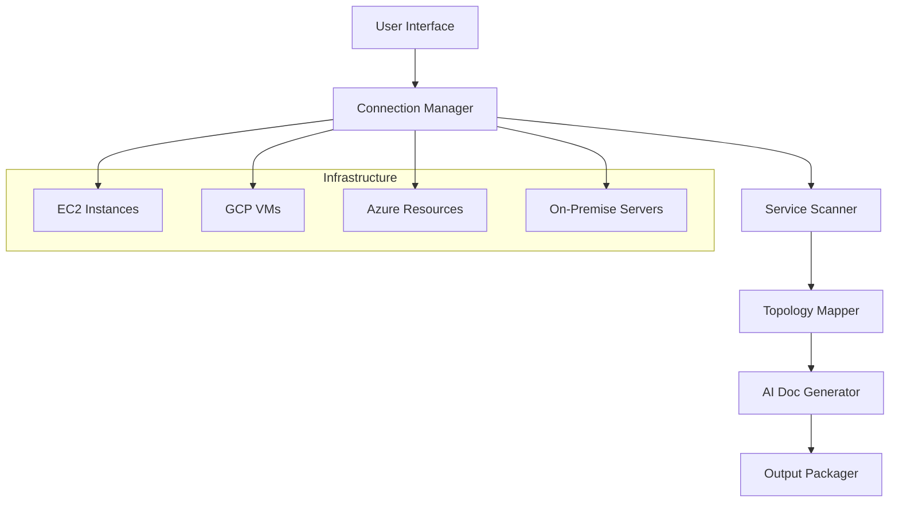

# InfraDoc
InfraDoc is an AI-agent that connects to live servers via SSH, analyzes running applications and configurations, and auto-generates architecture diagrams, security reports, and infrastructure documentation using LLMs.

# Working-Demo: 
https://youtu.be/4riPhf1dcAM

## Project Files

- `infradoc_core.py` – SSH connector, LLM orchestrator and discovery helpers.
- `infradoc_analyzer.py` – orchestrates scans and aggregates results.
- `infradoc_docs.py` – turns analysis data into markdown documentation.
- `infradoc_cli.py` – command line interface for running scans.

## Installation

Install the required libraries:

```bash
pip install paramiko openai anthropic
```

Set API keys for LLM-powered analysis:

```bash
export XAI_API_KEY="sk-..."
export OPENAI_API_KEY="sk-..."
export ANTHROPIC_API_KEY="sk-ant-..."
```

### 🔧 Core Features

- SSH-based service discovery
- Optional AI analysis for security and architecture insights
- Markdown reports and mermaid diagrams
- Quick and deep scan modes via CLI

### 🚀 Quick Start

```bash
# Quick scan
python Infra-doc2/infradoc_cli.py quick --host server.example.com --key-file ~/.ssh/id_rsa

# Deep analysis with full documentation
python Infra-doc2/infradoc_cli.py deep --host server.example.com --key-file ~/.ssh/id_rsa
```

### 🎯 Use Cases

- Infrastructure onboarding
- Security auditing
- Architecture visualization

---


#### The Vision
An AI-powered tool that connects to real, deployed infrastructure via SSH, auto-discovers services, and generates up-to-date documentation and architecture maps — especially in complex, multi-cloud environments.

#### 🧠 Problem Statement
Current Code and Service Intelligence Solutions works brilliantly at the repository level, but real-world teams face infrastructure documentation challenges:
- **Outdated docs** — teams never update Confluence or Notion when infrastructure changes
- **Lack of visibility** — multi-cloud, multi-VM setups are impossible to track manually
- **Onboarding pain** — new developers don't know what's running where
- **Debugging friction** — root cause analysis is hard when infrastructure isn't documented

**Even Datadog doesn't handle this today** — InfraDoc Agent Brings AI analysis to deployed systems.

#### 🧱 System Architecture



**Core Components:**

1. **User Input Interface**
   - CLI or Web UI for configuration
   - Accepts: IPs/hostnames, SSH credentials, metadata (cloud provider, regions)

2. **Connection Manager**
   - Secure SSH session management
   - Parallel workers for multiple machines
   - Stateless design with optional encrypted storage

3. **Service Scanner** (per machine)
   - `ps aux` → running processes
   - `netstat -tuln` → open ports  
   - `docker ps, docker inspect` → containerized services
   - Config file analysis (nginx.conf, .env, /etc configs)
   - Tech stack identification (Django, Node, Redis, PostgreSQL)

4. **Topology Mapper**
   - AI-powered inference of service communication
   - Maps database connections and API dependencies
   - Identifies external service integrations

5. **AI Doc Generator**
   - LLM-powered architecture documentation
   - Mermaid/PlantUML diagram generation
   - Integration with existing Dosu knowledge base

#### 🧪 Real-World Example

**Given Infrastructure:**
- 2 EC2 instances (Node.js app + Redis)
- 1 DigitalOcean Droplet (Django API)
- 1 GCP VM (PostgreSQL database)
- VPN connectivity between environments

**InfraDoc Agent Discovery:**
- Node app on :3000 → calls Redis :6379 + Django :8000
- Django .env → points to PostgreSQL on GCP IP
- Inferred 3-tier architecture with external database

**Generated Output:**
- `architecture.md` with comprehensive service descriptions
- `infrastructure-diagram.mmd` with visual topology
- `service-dependencies.json` for programmatic access
- Integration with existing Dosu documentation

#### 🚀 Why We Need This

- **Live Infrastructure Context**: Enhances the repository intelligence tools like learnchain (https://thelearnchain.com) with deployment reality
- **Enhanced Bug Triage**: See exactly where affected services are running
- **Enterprise Value**: Critical for large organizations with complex infrastructure
- **Market Differentiation**: No other code intelligence platform offers infra-aware AI

#### 🔐 Security & Compliance

- Read-only SSH access (never writes to servers)
- In-memory processing with optional ephemeral mode
- Audit logging for all infrastructure access
- Supports air-gapped and private cloud deployments

---
